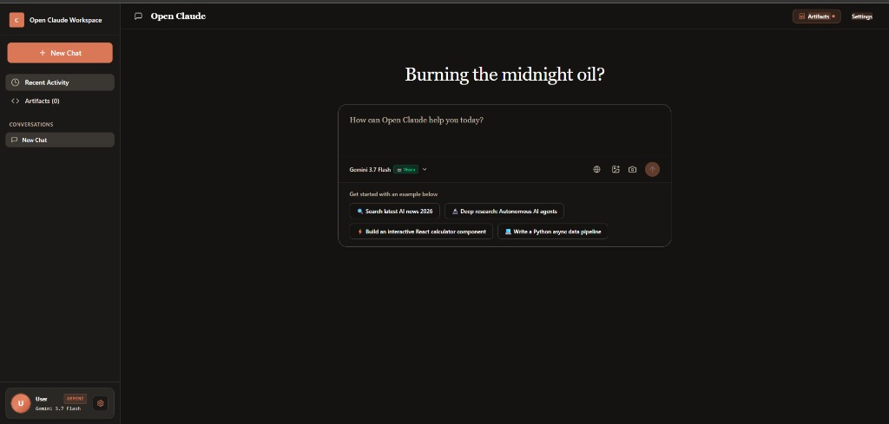
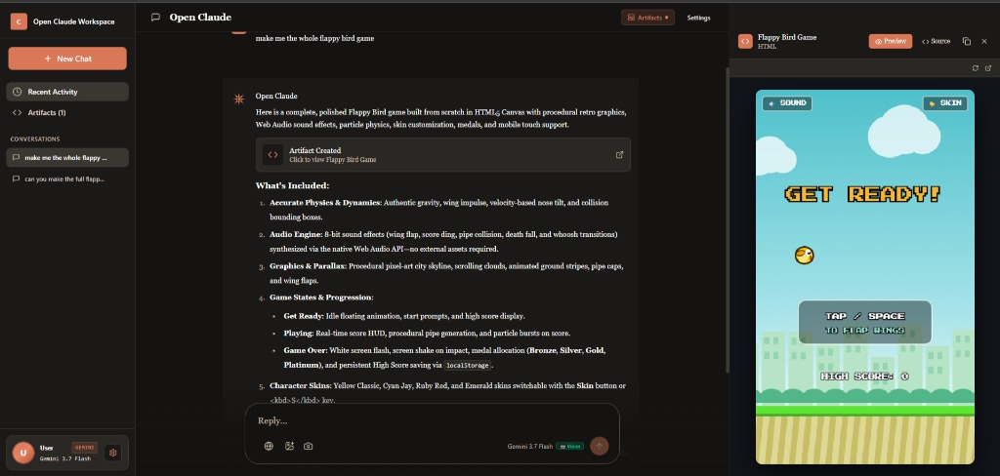

# 🤖 Open Claude

<div align="center">

**Next-Generation Open-Source Claude AI Workspace with Multimodal Vision, Live Webcam Capture, Deep Research, CoT Reasoning Stream, and Multi-CDN Resilient Artifacts**

[](https://reactjs.org/)
[](https://vitejs.dev/)
[](https://tailwindcss.com/)
[](LICENSE)

[Features](#-key-features) • [Screenshots](#-interface-showcase) • [Quick Start](#-quick-start) • [Supported Providers](#-supported-providers--models) • [Artifact Runner](#-universal-interactive-artifacts) • [License](#-license)

</div>

---

## 📖 Overview

**Open Claude** is a state-of-the-art, open-source AI desktop workspace inspired by Anthropic's Claude 3.7 interface. Built for power users, developers, and researchers, Open Claude unifies top cloud models (**Google Gemini**, **Groq**, **OpenAI**) and local offline LLMs (**Ollama**, **LM Studio**) into a unified, human-centered UI.

---

## 📸 Interface Showcase

### 1. Main Workspace & Time-Aware Interface
> Featuring dynamic context greetings, integrated prompt suggestions, live vision capability badges, web search toggle, and instant camera / file upload.

<div align="center">
  
</div>

### 2. Interactive Split-Screen Artifacts Sandbox
> Run complete HTML5 games, Canvas applications, interactive React components, and deep research papers side-by-side with real-time code inspection and execution.

<div align="center">
  
</div>

---

## ✨ Key Features

### 📷 Dynamic Multimodal & Webcam Capture
- **Live Camera Viewfinder**: Tap the camera icon (📷) to open a built-in webcam capture modal with live viewfinder, front/back camera flipping, and shutter review ("Use Photo" / "Retake").
- **API-Level Dynamic Vision Detection**: No hardcoded lists — Open Claude dynamically inspects provider API manifests and metadata (e.g. Ollama `details.families`, Gemini multimodal descriptions, LM Studio architectures).
- **Intelligent Auto-Switching**: When you capture or upload a picture while on a text-only model (e.g., Groq `llama-3.3-70b-versatile`), Open Claude automatically switches to the provider's top vision model (`llama-3.2-11b-vision-preview` / `gpt-4o`).
- **Clipboard Paste (`Ctrl+V`)**: Paste images or screenshots directly into the prompt box.

---

### 📦 Universal Resilient Artifact Runner
- **Interactive Sandbox**: Automatically renders and runs:
  - **HTML5 & Canvas Games**: Full game loops, Web Audio API procedural sound synthesis, and local storage state (e.g. Flappy Bird Deluxe).
  - **React / JSX Applications**: Transpiled on-the-fly via Babel Standalone with support for React Hooks, Lucide Icons, and Recharts.
  - **SVG Graphics**: Visual vector rendering.
  - **Research Papers**: Formal academic format with one-click PDF download.
- **Multi-CDN Resilience**: Sequential fallback (unpkg $\rightarrow$ Cloudflare CDNJS $\rightarrow$ jsDelivr) prevents white screens or failures if any individual CDN is blocked or rate-limited.
- **Universal Tag Parsing**: Flexibly parses `<antArtifact>` tags and code blocks from Claude, Gemini, Groq, OpenAI, and Ollama in any attribute order or format.

---

### 🧠 Universal CoT Thinking & Reasoning Stream
- **Live Streamed Thoughts**: Real-time token-by-token rendering of `<think>` and `<thinking>` tags alongside native API reasoning fields (`reasoning_content` / `reasoning`).
- **DeepSeek R1 on Groq & Ollama**: Seamlessly view DeepSeek's step-by-step mathematical and logical reasoning.
- **Metrics & Tokens**: Displays total reasoning token count and elapsed thinking duration.
- **Collapsible Design**: Elegant gradient accordion to expand or collapse internal monologue.

---

### 🔬 Deep Research Scientist Mode
- **Autonomous Multi-Step Loop**: Type `deep research: <topic>` to trigger an autonomous research agent that formulates sub-queries, queries real-time web databases, gathers evidence, and writes comprehensive multi-page whitepapers.
- **Formal PDF Export**: Export compiled research reports to PDF with structured abstracts, methodology, analysis, and bibliography.
- **Verifiable Citations**: Automatic source citation links with verified publisher logos and favicons.

---

### 🌐 Intelligent Real-Time Web Search
- **Tavily API Integration**: Search the live web for breaking news, current events, and documentation.
- **Smart Query Reformulation**: Contextually optimizes search keywords and strips unnecessary prefixes.
- **Publisher Logos**: Automatically fetches high-resolution publisher favicons for all referenced sources.

---

## 🤖 Supported Providers & Models

| Provider | Supported Models | Capabilities | Vision |
| :--- | :--- | :--- | :---: |
| **Google Gemini** | `gemini-3.7-flash`, `gemini-2.5-pro`, `gemini-2.5-flash`, `gemini-2.0-flash` | Multimodal, Long Context, Search | ✅ |
| **Groq Cloud** | `llama-3.3-70b-versatile`, `llama-3.2-11b-vision-preview`, `llama-3.2-90b-vision-preview`, `deepseek-r1-distill-llama-70b` | Ultra-fast inference, Real-time reasoning | ✅ |
| **OpenAI** | `gpt-4o`, `gpt-4o-mini`, `o1`, `o3-mini`, `gpt-4-turbo` | General purpose, Function calling, Vision | ✅ |
| **Ollama (Local)** | `llama3.2-vision`, `qwen2.5-vl`, `deepseek-r1`, `llava`, `mistral`, `gemma2` | Private, 100% offline, GPU-accelerated | ✅ |
| **LM Studio** | Any GGUF model (`qwen2-vl`, `minicpm-v`, `phi-3.5`) | Local inference with OpenAI-compatible API | ✅ |

---

## 🚀 Quick Start

### 1. Prerequisites
- **Node.js** 18.0 or higher ([Download Node.js](https://nodejs.org/))
- **npm** or **pnpm** or **yarn**
- **Git** ([Download Git](https://git-scm.com/))

### 2. Installation

```bash
# 1. Clone the repository
git clone https://github.com/Damienchakma/Open-claude.git
cd Open-claude

# 2. Install dependencies
npm install

# 3. Start development server
npm run dev
```

Open your browser and navigate to **`http://localhost:5173`**.

---

## ⚙️ Configuration & API Keys

Click the **Settings** icon (⚙️) in the sidebar or top bar to add your keys:

- **Google Gemini**: Get key from [Google AI Studio](https://aistudio.google.com/app/apikey)
- **Groq Cloud**: Get key from [Groq Console](https://console.groq.com/keys)
- **OpenAI**: Get key from [OpenAI Platform](https://platform.openai.com/api-keys)
- **Tavily (Web Search)**: Get key from [Tavily Dashboard](https://tavily.com/)

> [!NOTE]
> All API keys and chat histories are stored **100% locally in your browser's `localStorage`**. Your keys are never sent to any third-party intermediary servers.

---

## ⌨️ Keyboard Shortcuts

| Shortcut | Action |
| :--- | :--- |
| `Enter` | Send message |
| `Shift + Enter` | Insert new line in prompt |
| `Ctrl + V` | Paste image directly into prompt |
| `Space` / `↑` | Jump / flap in game artifacts (e.g. Flappy Bird) |
| `P` | Pause / resume interactive game artifacts |

---

## 🛠️ Tech Stack

- **Core**: React 18, Vite 5, Vanilla JavaScript (ES2024)
- **Styling**: Tailwind CSS + Custom Humanist Theme Tokens
- **Markdown & Code**: `react-markdown`, `remark-gfm`, `rehype-raw`, `react-syntax-highlighter`
- **Icons**: Lucide React
- **PDF Generation**: `jspdf`, `html2canvas`
- **In-Browser Transpilation**: Babel Standalone (`@babel/standalone`)

---

## 🤝 Contributing

Contributions, issues, and feature requests are welcome!

1. Fork the Project
2. Create your Feature Branch (`git checkout -b feature/AmazingFeature`)
3. Commit your Changes (`git commit -m 'Add some AmazingFeature'`)
4. Push to the Branch (`git push origin feature/AmazingFeature`)
5. Open a Pull Request

---

## 📝 License

Distributed under the **MIT License**. See [`LICENSE`](LICENSE) for more information.

---

<div align="center">

Built with ❤️ by [Damien Chakma](https://github.com/Damienchakma)

**[⬆ Back to Top](#-open-claude)**

</div>
